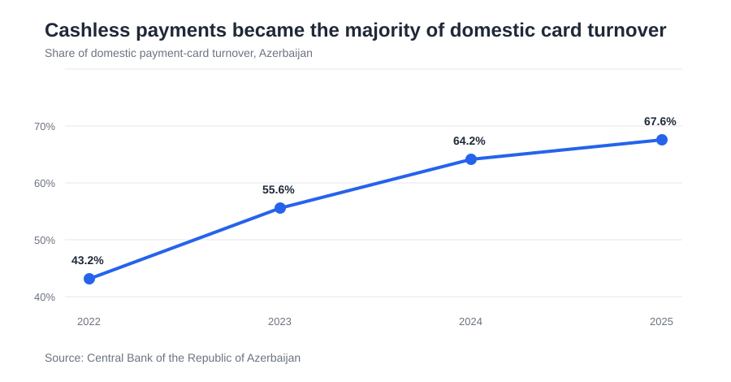
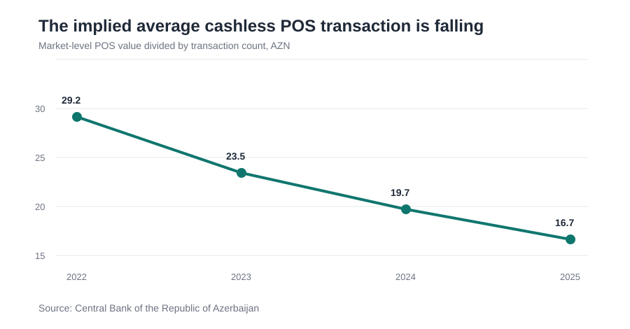
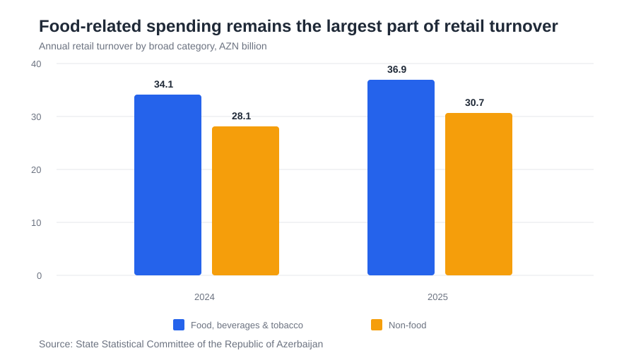

# Azerbaijan Retail & Digital Payments Analytics

**Python · SQL · Pandas · Matplotlib**

A business analytics project using official public data from the **Central Bank of the Republic of Azerbaijan** and the **State Statistical Committee** to examine how retail spending and payment behaviour are changing in Azerbaijan.

## Business question

**How is consumer spending in Azerbaijan changing, and what does the shift toward digital payments imply for retailers?**

## At a glance

| Metric | 2022 | 2025 | Change |
|---|---:|---:|---:|
| Domestic cashless card value | AZN 24.4B | AZN 99.1B | **+306%** |
| Cashless share of domestic card turnover | 43.2% | 67.6% | **+24.4 pp** |
| Domestic e-commerce payment value | AZN 18.5B | AZN 86.4B | **+366%** |
| Implied average cashless POS transaction | AZN 29.2 | AZN 16.7 | **-43%** |

## What the data says

### 1. Cashless payments have moved from minority to majority behaviour



The cashless share of domestic payment-card turnover rose from **43.2% in 2022 to 67.6% in 2025**.

**Retail implication:** digital payment acceptance is now part of the core customer experience rather than a secondary payment channel.

### 2. Cards are being used more often for lower-value POS transactions



Cashless POS transaction count increased from **199.1M to 760.5M** between 2022 and 2025, while POS value increased from **AZN 5.8B to AZN 12.7B**.

Because transaction count grew much faster than value, the implied average POS transaction fell from roughly **AZN 29.2 to AZN 16.7**.

**Retail implication:** at market level, this is consistent with card payments moving further into frequent, lower-value purchases (particularly relevant to high-frequency retail such as grocery).

### 3. Food-related spending remains the largest part of retail turnover



Azerbaijan recorded **AZN 67.6B of retail turnover in 2025**. Food, beverages and tobacco accounted for **AZN 36.9B**, or about **55%** of the total.

Real growth was slower in food-related categories (**1.2%**) than in non-food (**6.8%**), but the food segment remains large and comparatively stable.

**Retail implication:** grocery-related demand represents a substantial base of consumer spending even when faster growth is occurring elsewhere in retail.

### 4. E-commerce is growing faster than overall cashless card spending

Domestic e-commerce payment value increased from **AZN 18.5B in 2022 to AZN 86.4B in 2025**, approximately **366% growth**.

Over the same period, total domestic cashless card value grew by about **306%**.

By 2025, domestic e-commerce payment value was equivalent to roughly **87% of total domestic cashless card value**. This is a payment-flow comparison, not a measure of retailer-level online sales.

**Retail implication:** digital purchasing behaviour is expanding alongside digital payment adoption, increasing the importance of strong online purchase and payment experiences.

## What I would investigate with retailer-level data

The public data shows market direction, but not individual customer behaviour. With transaction-level retail data, I would next test:

- **Repeat behaviour:** how reorder frequency and retention vary by customer cohort.
- **Basket behaviour:** how average basket size changes by category, day and purchase channel.
- **Demand patterns:** which hours, days and product groups create the largest operational peaks.
- **Digital vs physical behaviour:** whether online and in-store customers differ in frequency, spend and product mix.

These questions would turn the market-level signals in this project into decisions about assortment, operations, retention and capacity.

## Analysis approach

The project deliberately uses a simple, reproducible analytics stack rather than a predictive model.

1. Collected official public payment and retail statistics.
2. Structured the published figures into analysis-ready CSV tables.
3. Used **SQL** to calculate channel shares, growth rates and implied transaction values.
4. Used **Python/Pandas** to validate and extend the analysis.
5. Used **Matplotlib** to visualise the main trends.
6. Translated the findings into retail implications while keeping market-level limitations explicit.

## Repository structure

```text
.
├── data/
│   ├── payment_cards_2022_2025.csv
│   └── retail_turnover_2024_2026.csv
├── figures/
│   ├── cashless_share.svg
│   ├── pos_average_ticket.svg
│   └── retail_mix.svg
├── sql/
│   └── analysis.sql
├── src/
│   └── analysis.py
├── SOURCES.md
└── requirements.txt
```

## Run the analysis

```bash
pip install -r requirements.txt
python src/analysis.py
```

The script loads and validates the source tables, calculates the main metrics, runs the SQL analysis in SQLite and generates the charts locally.

## Data limitations

- **Market-level data:** the sources do not identify individual customers, baskets, retailers or retention behaviour.
- **Nominal vs real:** retail turnover values are nominal AZN figures, while official growth rates are reported in real terms.
- **Annual vs YTD:** the 2026 retail data covers January-August and should not be compared directly with full-year totals.
- **2025 e-commerce count:** the Central Bank reports the transaction count as **1.5 billion**, so it is rounded and not used for high-precision average-ticket analysis.

See **[SOURCES.md](SOURCES.md)** for the exact official source documents, field definitions and interpretation notes.
